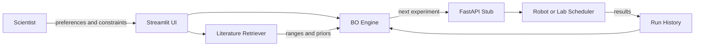

# ChemLoop Studio

**ChemLoop Studio** is a publishable AI-for-science portfolio project: an interactive, human- and literature-informed closed-loop optimisation workbench for polymer and materials experiments.

It demonstrates an end-to-end workflow for **AI/ML-driven chemical and materials discovery**:

- **Closed-loop Bayesian optimisation** with uncertainty-aware experiment suggestion.
- **Human-in-the-loop control** so a scientist can adjust bounds, constraints, or preferences.
- **Literature-informed priors** using lightweight retrieval over a small scientific corpus.
- **Multi-objective exploration** for trade-offs such as performance versus yield or process cost.
- **FastAPI robotics stub** for connecting suggested experiments to a scheduler, robot, or lab notebook.
- **Streamlit interface** so the project is easy to demonstrate to both AI and R&D audiences.

> Portfolio positioning: **Applied AI / Machine Learning Researcher with PhD-level scientific R&D expertise**.

---

## Why this project is suitable and novel for your GitHub

Many AI portfolio projects stop at prediction. ChemLoop Studio is stronger because it shows the full scientific decision loop:

```text
literature evidence → suggested bounds → surrogate model → next experiment → API/lab handoff → updated history
```

This is a better career signal than a standalone notebook because it proves you can connect machine learning, interface design, scientific reasoning, and reproducible software.

---

## Quickstart

### 1) Create environment and install

```bash
python -m venv .venv
# Windows: .venv\Scripts\activate
source .venv/bin/activate

pip install -r requirements.txt
```

Optional editable install:

```bash
pip install -e .
```

### 2) Run the Streamlit app

```bash
streamlit run app/Home.py
```

Open the local URL shown by Streamlit, usually:

```text
http://localhost:8501
```

### 3) Run the FastAPI robotics/API stub

In another terminal:

```bash
uvicorn mds.api:app --reload --port 8000
```

Then open:

```text
http://localhost:8000/docs
```

### 4) Run tests

```bash
pytest -q
```

---

## What you can demo in 2 minutes

1. **Closed-loop BO:** propose a new electrospinning condition, simulate outcome, retrain the Gaussian-process surrogate, and repeat.
2. **Literature priors:** search the small literature corpus, extract suggested voltage/concentration ranges, and use them as optimisation bounds.
3. **Multi-objective trade-offs:** explore a synthetic porous-materials problem and visualise the Pareto front.
4. **Robotics bridge:** call `POST /suggest_next` to return the next experiment in JSON.

---

## Architecture



---

## Repository layout

```text
chemloop-studio/
├── app/                    # Streamlit UI
├── mds/                    # Core package: BO, literature retrieval, API, utilities
├── data/                   # Demonstration literature corpus and toy inputs
├── docs/                   # Project brief, data card, model card, roadmap
├── tests/                  # Pytest tests
├── .github/workflows/      # CI workflow
├── Dockerfile              # API container
├── Makefile                # Common developer commands
├── pyproject.toml          # Package metadata
├── requirements.txt        # Runtime dependencies
└── README.md
```

---

## Scientific caution

The included data are small demonstration records. They are intended for portfolio demonstration, testing, and reproducibility. They are not validated experimental recommendations and should not replace literature review, safety review, or wet-lab confirmation.

---

## Roadmap

See [`docs/ROADMAP.md`](docs/ROADMAP.md).

---

## License

MIT License. See [`LICENSE`](LICENSE).
